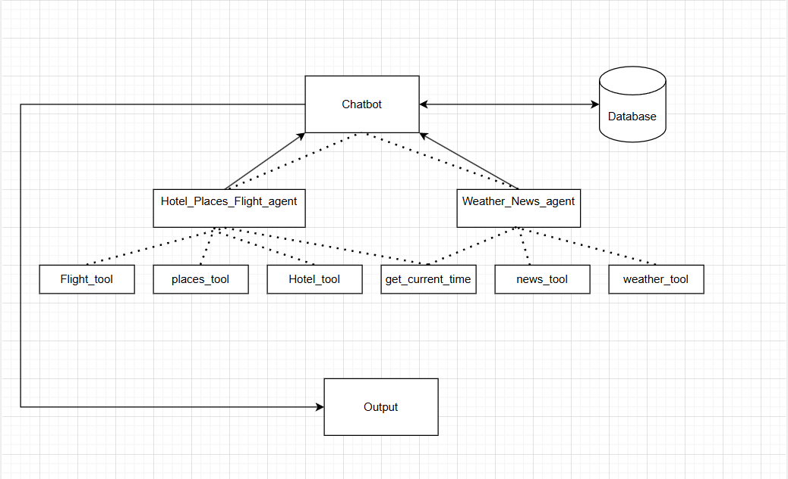

# TravelSynk - Personalized Travel Planner Chatbot


## **Project Overview**
TravelSynk is a personalized travel planner chatbot that helps users plan their trips by providing real-time information on flights, hotels, tourist attractions, and weather updates. The chatbot is designed with a structured architecture that integrates multiple tools and agents to process user queries efficiently.


---

## **Features**
- **Personalized Travel Assistance**: Provides tailored recommendations for flights, hotels, and places.
- **Real-time Weather and News Updates**: Fetches weather and news data for better travel planning.
- **Secure User Authentication**: Ensures only authenticated users can access personal data.
- **Chatbot Memory with Threaded Conversations**: Stores chat history based on threads.
- **User Management**: Allows users to create, update, and delete their accounts.
- **API Design**: Provides structured API endpoints for seamless interactions.

---

## **Database Details**
The system uses an **SQLite** database with the following tables:

### **1️⃣ User Table (`User`)**
Stores user account details:
- `name` (string) → User’s full name.
- `username` (string) → Unique username.
- `email` (string) → Email address.
- `phone` (string) → Phone number.
- `password` (string) → Stored encrypted password.

### **2️⃣ Chat History Table (`History`)**
Stores chatbot interactions **based on threads**:
- `user_id` (foreign key) → Links to the `User` table.
- `thread_id` (int) → Groups messages into threads for better context.
- `message_type` (string) → Type of message (`HumanMessage`, `AIMessage`).
- `content` (string) → Message content.
- `timestamp` (datetime) → Time when the message was stored.

---

## **API Endpoints**

### **1️⃣ Authentication Endpoints (`app.auth.auth.py`)**
1. **`POST /login`** → User login and JWT token generation.
2. **`GET /me`** → Retrieve authenticated user details. _(Authentication required)_

### **2️⃣ Chatbot Endpoints (`app.api.v1.chat.py`)**
3. **`POST /chat`** → Process user input, return chatbot response, and store the chat **based on threads** in the database. _(Authentication required)_
4. **`GET /chat/history`** → Retrieve the chat history of the authenticated user. _(Authentication required)_

### **3️⃣ User Management Endpoints (`app.api.v1.UsersOperations.py`)**
5. **`POST /users/`** → Create a new user.
6. **`GET /user/`** → Retrieve a list of users.
7. **`GET /user/{user_id}`** → Fetch details of a specific user.
8. **`PUT /user/{user_id}`** → Update user details. _(Authentication required)_
9. **`DELETE /user/{user_id}`** → Delete a user.

---

## **Authentication**
- Uses **OAuth2 with Password and JWT tokens** for authentication.
- **Protected Endpoints**:
  - `GET /me`
  - `POST /chat`
  - `GET /chat/history`
  - `PUT /user/{user_id}`
- **Authorization Rules**:
  - Only **logged-in users** can access chat history and update personal details.
  - Users **cannot** access or modify other users’ data.

---

## **Technical Details**
- **Framework:** FastAPI
- **Database:** SQLite
- **ORM:** SQLAlchemy
- **Authentication:** OAuth2 (JWT Tokens, Password Hashing)
- **AI Integration:** LangChain OpenAI API
- **External APIs Integrated:**
  - **SerpAPI (Google Engine)** → Fetches search results.
  - **CurrentsAPI** → Provides real-time news updates.
  - **OpenWeather API** → Retrieves weather data.
- **External Tools & Agents:**
  - `Hotel_Places_Flight_agent.py` → Fetches hotel, places, and flight details.
  - `Weather_News_agent.py` → Fetches weather and news updates.
- **Storage:** User chat history is stored in SQLite, organized **by threads**.

---

## **Future Enhancements**
- **AI-powered itinerary generation** based on user preferences.
- **Voice command support** for a hands-free travel planning experience.
- **Multi-user collaboration** for group trip planning.
- **Integration with booking services** for direct hotel and flight reservations.

---

## **How to Run the Project**

1. **Create a `.env` file**  
   - Copy the example environment file:  
     ```bash
     cp .env.example .env
     ```
   - Fill in the required credentials (API keys, database settings, etc.) by referring to `.env.example`.

2. **Install Dependencies**  
   - Run the following command to install all required packages:  
     ```bash
     pip install -r requirements.txt
     ```

3. **Run the Project**  
   - Start the FastAPI application using Uvicorn:  
     ```bash
     uvicorn main:app --reload
     ```

Your **TravelSynk** chatbot should now be running locally! 🚀

---

## **File Structure**
```
📄 .env
📄 .env.example
📄 .gitignore
📄 README.md
📄 TravelSynk.db
📂 app
   📄 __init__.py
   📂 agents
      📄 AgentCaller.py
      📄 __init__.py
   📂 api
      📄 __init__.py
      📂 v1
         📄 UsersOperations.py
         📄 __init__.py
         📄 chat.py
   📂 auth
      📄 __init__.py
      📄 auth.py
   📂 core
      📄 __init__.py
      📄 config.py
      📄 database.py
   📂 db
      📄 __init__.py
      📄 messageHistory.py
      📄 users.py
   📂 llm
   📂 models
      📄 __init__.py
      📄 chat_history.py
      📄 users.py
   📂 prompts
      📄 AgentPrompt.py
      📄 ChatPrompt.py
   📂 schemas
      📄 Agnet.py
      📄 Auth.py
      📄 Chat.py
      📄 Flight.py
      📄 Hotel.py
      📄 News.py
      📄 Places.py
      📄 UserOperation.py
      📄 Weather.py
      📄 __init__.py
   📂 tools
      📄 Hotel_Places_Flight_agent.py
      📄 Weather_News_agent.py
      📄 __init__.py
      📄 current_time.py
      📄 flight.py
      📄 hotel.py
      📄 news.py
      📄 places.py
      📄 weather.py
   📂 utils
      📄 HashPassowrd.py
      📄 VerifyPassword.py
      📄 __init__.py
📂 docs
📄 main.py
📄 requirements.txt
📄 users.db
```

---

## **Conclusion**
TravelSynk is a robust, AI-powered travel planner chatbot that offers users an interactive way to plan their trips securely. With real-time data, personalized recommendations, and a structured API design, it ensures seamless and efficient trip planning.

